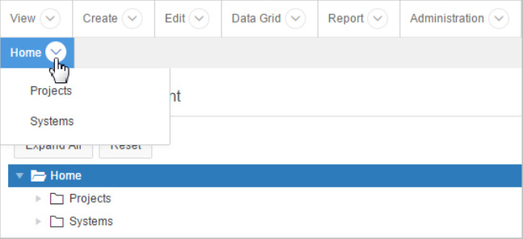

# About Oracle Application Express
This section offers an introduction to using Oracle Application Express applications from an end user’s perspective. This section describes Oracle Application Express and explains the differences between Websheet applications and database applications.
- [Go To Browser Requirements](Browser Requirements)
- (About Oracle Application Express)
- (About Websheet Applications)
- (About Database Applications)
[Google](https://www.google.com/webhp?rct=j)
## Browser Requirements
Because Oracle Application Express relies upon standards-compliant HTML5, CSS3, and JavaScript, Oracle recommends that you use the latest web browser software available for the best experience. To learn more, see **Browser Requirements** in *Oracle Application Express Installation Guide*.
## About Oracle Application Express
Oracle Application Express is a rapid web application development tool for the Oracle Database. Through wizards or direct input, developers can assemble an HTML interface (or application) on top of database objects. Each application is a collection of linked pages using tabs, buttons, or hypertext links.  
By creating an application, users can manage, manipulate, and display data in the Oracle Database. Using Oracle Application Express, developers can build two types of applications:
- Websheet applications
- Database applications

## About Websheet Applications
Websheet applications are interactive web pages that combine text with data. These
applications are highly dynamic and defined by their users. Websheet applications
include navigation controls, search capabilities, and the ability to add annotations such
as files, notes, and tags. Websheet applications can be secured using access control lists
and several built-in authentication models.  
## About Database Applications
Using only a web browser and with limited programming experience, Oracle
Application Express enables developers to create powerful database applications. A
database application is an interactive user interface (UI) that enables users to quickly
add, update, or display information stored in the Oracle Database. This UI can display
information in many formats, including static and interactive reports, forms, maps,
charts, and maps.  

This guide explains how end users can customize an interactive report. With an
interactive report, end users can customize the appearance of report data through
searching, filtering, sorting, column selection, highlighting, and other data
manipulations. Plus, end users can save their customizations and download the report
locally.

**Table 1: List of Fruits and Colors**

| Fruit  | Color   |
|--------|---------|
| Apple  | Red     |
| Banana | Yellow  |
| Grape  | Purple  |

